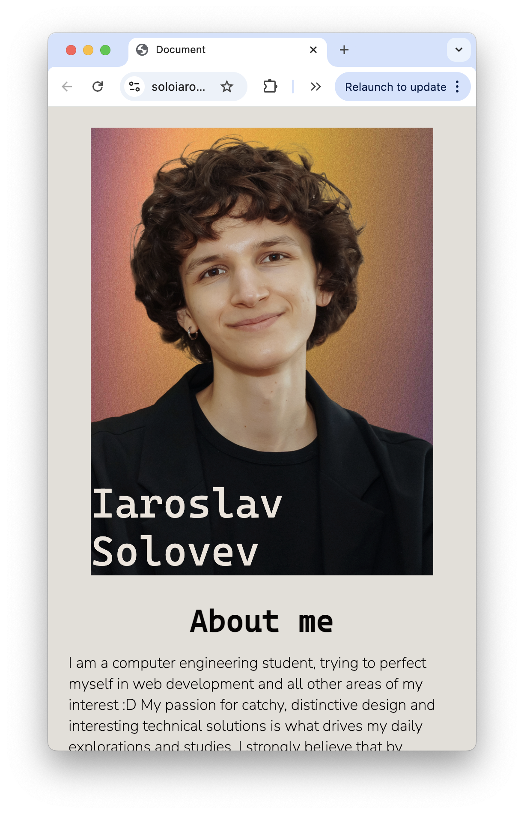
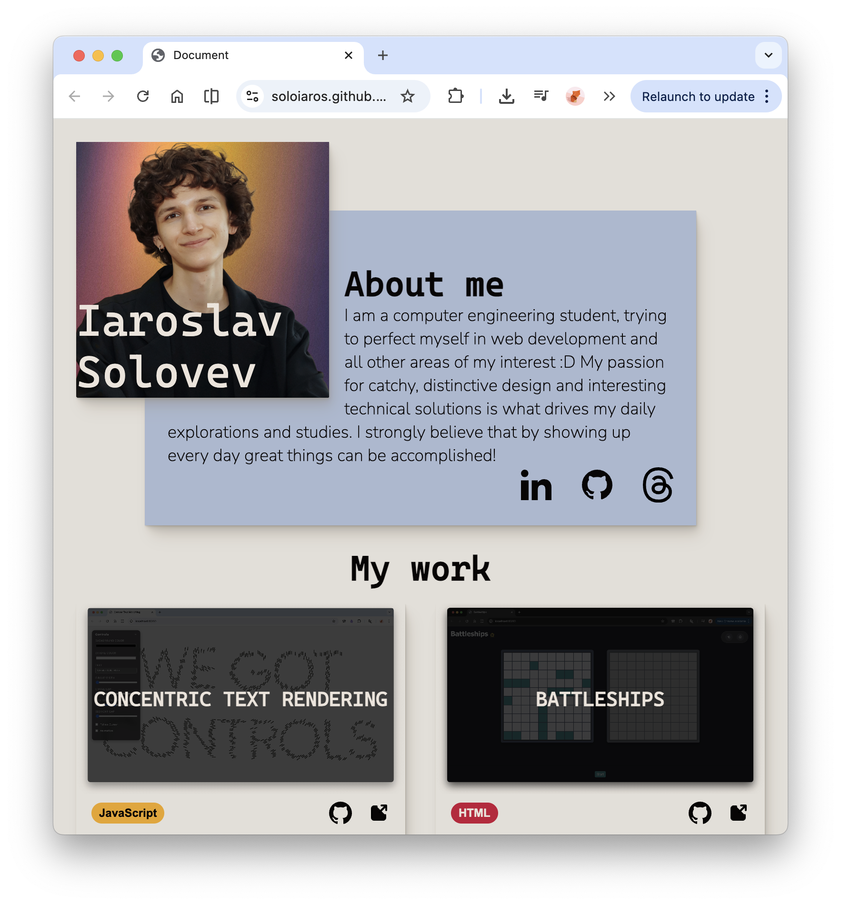
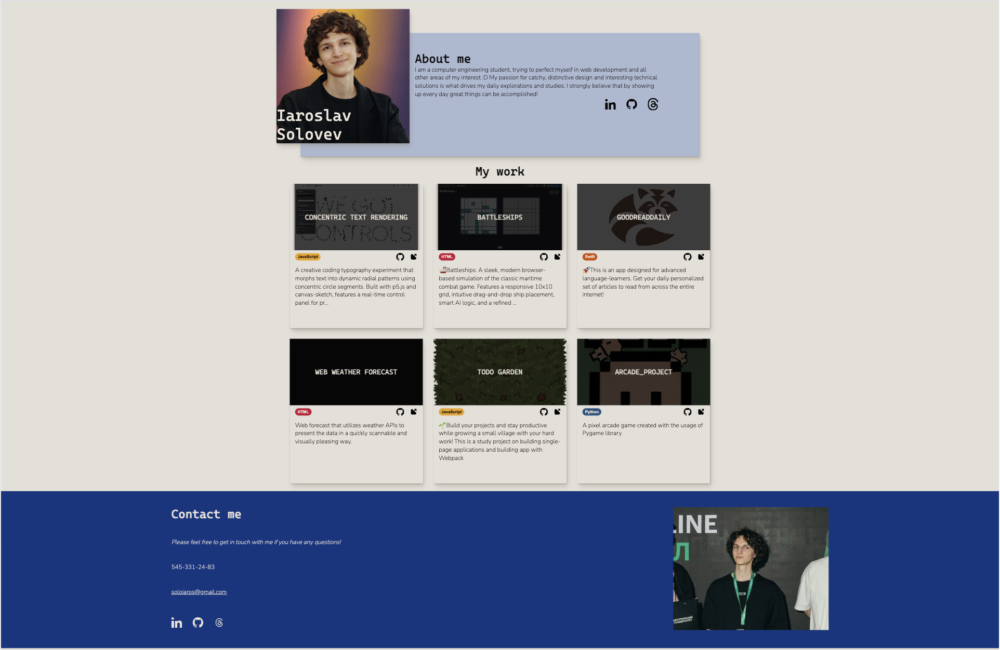

# Responsive Portfolio Homepage

An exploration of responsive layout design, built with a mobile-first approach to ensure a seamless user experience across all devices, from small phones to high-resolution desktop monitors.

## Overview

This project is a dynamic portfolio homepage that showcases personal work by fetching pinned repositories from GitHub. It features a modern, fluid layout and interactive  designe focusing on visual style that accomodates for usage with accessibility features and tools.

### Device Snapshots

| Mobile Version | Tablet Version | Desktop Version |
| :---: | :---: | :---: |
|  |  |  |

---

## Technical Implementation

### Tech Stack
- **Frontend:** Semantic HTML5, Modern CSS3 (Flexbox/Grid/Variables), ES6+ JavaScript.
- **Build System:** Webpack 5 with Babel.
- **APIs:** Integration with the GitHub API for dynamic repository fetching and display.

### Core Features
- **Mobile-First Development:** Layouts designed for mobile initially, scaling up through media queries to desktop.
- **Adaptive Assets:** Responsive images using the `<picture>` element and optimized font loading.
- **Dynamic Content:** Automated project cards generated from live GitHub data (pinned repositories).
- **Optimized Performance:** Production-ready builds with minified assets and extracted CSS.

### Setup & Usage

1. **Install Dependencies:**
   ```bash
   npm install
   ```

2. **Start Development Server:**
   ```bash
   npm run serve
   ```

3. **Build for Production:**
   ```bash
   npm run build
   ```
